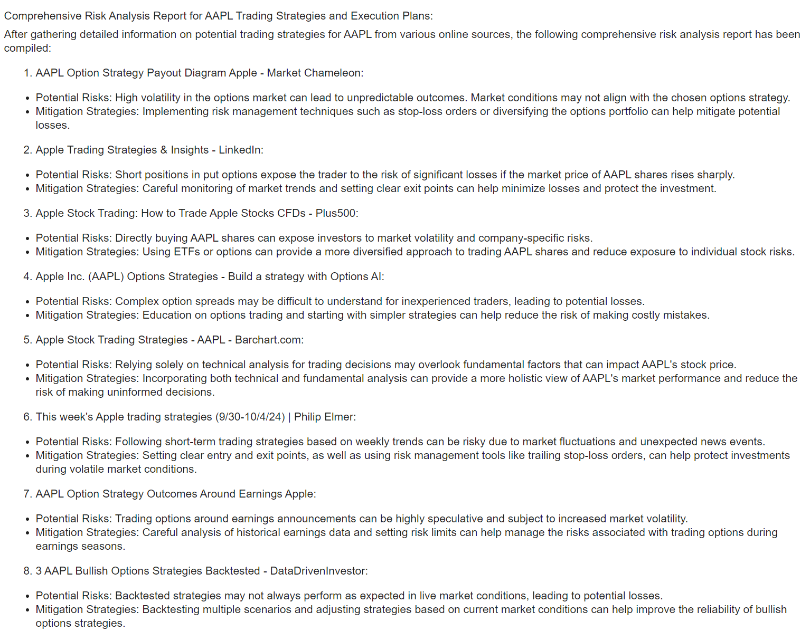

### Multi-Agent System for Automated Financial Analysis and Trading Strategy Optimization using CrewAI

This project implements a multi-agent collaboration system for financial analysis and trading strategy development using the crewai and crewai_tools libraries. The agents perform various tasks, such as market data analysis, trading strategy development, trade execution planning, and risk assessment. By integrating openai and serper API keys, the project automates insights gathering and strategy formulation for selected stocks.

1. Purpose: Automates financial analysis and trading strategy creation with multi-agent collaboration using CrewAI.

2. API Setup: Retrieves OpenAI and Serper API keys from environment variables to facilitate analysis and information retrieval.

3. Agents:

- Data Analyst Agent: Analyzes market data in real-time to identify trends.

- Trading Strategy Developer Agent: Develops trading strategies based on data insights.

- Trade Advisor Agent: Suggests optimal methods and timing for trade execution.

- Risk Advisor Agent: Evaluates trade risks and suggests mitigation strategies.

4. Tasks:

- Data Analysis Task: Monitors stock data and generates insights.

- Strategy Development Task: Creates risk-aligned trading strategies.

- Execution Planning Task: Recommends detailed trade execution plans.

- Risk Assessment Task: Provides comprehensive risk analysis reports.

5. Hierarchical Workflow:

- Structure: The agents work in a hierarchical, dependency-based order managed by CrewAI.

- Task Flow: Outputs from one agent inform the tasks of subsequent agents, ensuring an organized flow where each agent’s output is leveraged by the next.

- Manager LLM: A language model (ChatOpenAI) oversees the hierarchical workflow, coordinating agent interactions and decision-making.

6. Execution:

- Crew Initialization: Creates a Crew of agents and assigns tasks in a hierarchical order.

- Input Parameters: Accepts stock selection, initial capital, risk tolerance, and trading preferences.

- Run Process: Triggers the crew process to output actionable financial insights and strategies in an organized, collaborative manner.


### Project Structure

financial_analysis_using_CrewAI/

├── app.py                 # Main application code

├── requirements.txt       # Project dependencies

├── .env                   # Environment variables (store API keys here)

├── README.md              # Project documentation

├── results                # snapshot of results obtained for an example stock

### Features

- Data Analyst Agent: Analyzes real-time market data and predicts trends.

- Trading Strategy Developer Agent: Creates trading strategies based on data insights.

- Trade Advisor Agent: Suggests optimal trade execution methods.

- Risk Advisor Agent: Evaluates trading risks and suggests mitigation strategies.

- Crew Collaboration: Uses the Crew class to manage hierarchical collaboration between agents.


### Prerequisites
 
Python 3.7 or higher
 
OpenAI API Key
 
Serper API Key

### Installation

To run locally, clone the above repository, install requirements, create the .env file and add api keys:

```python
OPENAI_API_KEY=<your_openai_api_key>
SERPER_API_KEY=<your_serper_api_key>
```


### Usage
Run the application: In the app.py file, you can configure the stock selection and other parameters in the __main__ block.

```python
if __name__ == "__main__":
    stock_selection = 'AAPL'           # Set stock ticker
    initial_capital = '100000'         # Set initial capital
    risk_tolerance = 'Medium'          # Set risk tolerance level
    trading_strategy_preference = 'Day Trading'  # Set trading strategy
    
    # Execute the financial analysis
    result = run_financial_analysis(stock_selection, initial_capital, risk_tolerance, trading_strategy_preference)
    print(result)
```

Replace stock_selection and other variables to analyze different stocks or configurations.

### Execute the code:

```python
python app.py
```

### Expected Output

The output will display the results of the multi-agent collaboration, including insights on the stock's trends, recommended trading strategies, execution plans, and risk assessments.

### Project Structure and Code Overview

1. app.py
This is the main script that sets up agents and tasks, retrieves API keys, and runs the financial analysis. The run_financial_analysis function initializes the Crew object and kicks off the multi-agent process.


2. requirements.txt

Lists the dependencies for the project.

3. .env

This file stores sensitive information, such as API keys. 

### Example

To analyze the Microsoft stock with a high-risk tolerance:

Set up the following parameters in app.py:

```python
if __name__ == "__main__":
    stock_selection = 'MSFT'
    initial_capital = '200000'
    risk_tolerance = 'High'
    trading_strategy_preference = 'Swing Trading'
    
    result = run_financial_analysis(stock_selection, initial_capital, risk_tolerance, trading_strategy_preference)
    print(result)
```

The output should detail each agent’s findings and recommendations for the selected stock.

### Troubleshooting

- Missing API Keys: Ensure .env is correctly set up with valid API keys.

- Dependency Issues: Double-check requirements.txt to ensure all libraries are installed.

- Agent Initialization Errors: Confirm all agents are initialized with necessary tools, as defined in app.py.

### RESULT



